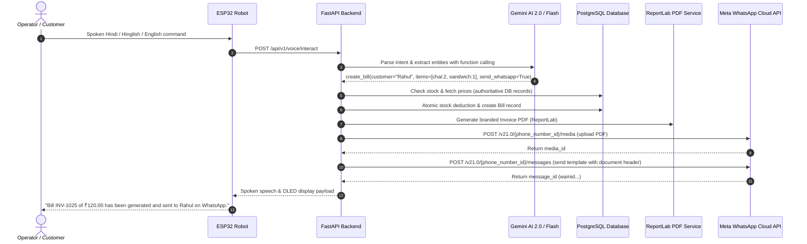

# Meta WhatsApp Business Cloud API Integration Guide

This guide describes the complete integration and configuration for automated WhatsApp invoice delivery using the official **Meta WhatsApp Business Cloud API** on the Business AI Robot platform.

---

## 1. Overview & Architecture

When a store operator speaks a voice command to the robot:

> *"Robot, Rahul ka 2 chai aur 1 sandwich ka bill bana ke WhatsApp kar do."*

The platform executes the following end-to-end pipeline:



---

## 2. Meta WhatsApp Utility Template Setup

### Approved Template Specification

To ensure 100% compliance with WhatsApp Business policies and 24-hour utility window requirements, the system uses an approved **Utility** template.

* **Template Name**: `invoice_bill_sent`
* **Category**: `UTILITY`
* **Language**: `en` (English / en_US)
* **Header Type**: `DOCUMENT` (Attached invoice PDF)

### Template Body Text:

```text
Hello {{1}},

Your bill from {{2}} has been generated.

🧾 Invoice: {{3}}

Items:
{{4}}

💰 Total: ₹{{5}}

Thank you for your business! 😊

Please find your bill attached.
```

### Template Parameter Mappings:

| Variable | Field | Description | Example |
|---|---|---|---|
| `{{1}}` | Customer Name | Full name of recipient customer | `Rahul` |
| `{{2}}` | Business Name | Store name from database records | `Apex Retail Mart` |
| `{{3}}` | Invoice Number | Unique bill/invoice number | `INV-20260905-1025` |
| `{{4}}` | Items Breakdown | Clean newline-separated item list | `2 × Tea — ₹40.00`<br/>`1 × Veg Sandwich — ₹80.00` |
| `{{5}}` | Total Amount | Grand total (tax/discount applied) | `120.00` |

---

## 3. Configuration & Environment Variables

Add the following keys to your `backend/.env` file:

```env
# Meta WhatsApp Business Cloud API Configuration
WHATSAPP_ACCESS_TOKEN=EAAB...your_system_user_or_temporary_token...
WHATSAPP_PHONE_NUMBER_ID=109876543210987
WHATSAPP_BUSINESS_ACCOUNT_ID=102345678901234
WHATSAPP_TEMPLATE_NAME=invoice_bill
WHATSAPP_TEMPLATE_LANGUAGE=en
WHATSAPP_API_VERSION=v21.0
WHATSAPP_DEFAULT_COUNTRY_CODE=91
```

### Getting Your Meta Credentials:
1. Log in to [Meta for Developers](https://developers.facebook.com/).
2. Navigate to **My Apps** &rarr; select or create your **Business App**.
3. Under **WhatsApp** &rarr; **API Setup**:
   - Copy the **Temporary Access Token** (or create a permanent **System User Token** in Business Manager).
   - Copy the **Phone Number ID**.
   - Copy the **WhatsApp Business Account ID (WABA ID)**.
4. Under **WhatsApp** &rarr; **Message Templates**:
   - Create a template named `invoice_bill` with Category `UTILITY`.
   - Add a `Document` header.
   - Paste the body text specified above.
   - Submit for instant Meta approval.

---

## 4. REST API Endpoints

### 1. Send Invoice on WhatsApp
`POST /api/v1/whatsapp/send-invoice`

**Request Body:**
```json
{
  "invoice_id": "INV-20260905-1025",
  "customer_id": "optional-uuid",
  "recipient_phone": "9876543210"
}
```

**Successful Response (HTTP 200):**
```json
{
  "status": "success",
  "message": "Bill INV-20260905-1025 sent successfully on WhatsApp.",
  "invoice_number": "INV-20260905-1025",
  "recipient": "919876543210",
  "message_id": "wamid.HBgMOTE5ODc2NTQzMjEwFQIAERgSMTQ1OTQ4QUFDREQzRTc5MzYA",
  "media_id": "1087452398412356"
}
```

### 2. WhatsApp Status Check
`GET /api/v1/whatsapp/status`

**Response (HTTP 200):**
```json
{
  "configured": true,
  "access_token_configured": true,
  "phone_number_id_configured": true,
  "template_name": "invoice_bill",
  "template_language": "en",
  "api_version": "v21.0",
  "default_country_code": "91"
}
```

---

## 5. Spoken Voice Feedback on Robot

The robot delivers immediate and authoritative voice responses:

| Situation | Spoken Response |
|---|---|
| **Immediate Acknowledgment** (<200ms) | `"Preparing invoice for WhatsApp..."` |
| **Success Response** | `"Bill {bill_number} of ₹{total} has been generated and sent to {customer_name} on WhatsApp."` |
| **Failure Response** | `"I generated the bill, but I couldn't send it on WhatsApp. Please check the customer's WhatsApp number."` |

---

## 6. PDF Invoice Generation

Invoices are generated using `InvoicePDFService` backed by ReportLab. 
Features of the generated PDF:
* Branded header with store name, address, and contact details.
* Customer details and invoice metadata (date, time, invoice #).
* Itemized table with product name, quantity, unit price, and subtotal.
* Calculation breakdown: Subtotal, GST/Tax, Discount, Grand Total.
* Payment status stamp (`PAID` / `PENDING`).
* Clean typography and styling suited for mobile viewing on WhatsApp.
